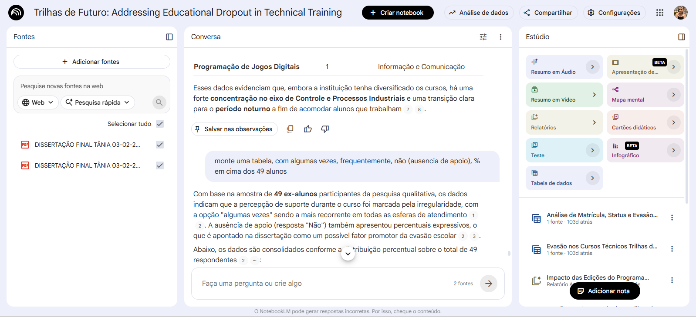

# Treinando uma IA de Aprendizagem com NotebookLM

## Objetivo do Projeto

Este projeto teve como objetivo explorar o uso do NotebookLM como ferramenta de apoio acadêmico e organizacional durante a análise de um Trabalho de Conclusão de Curso (TCC) relacionado ao programa Trilhas do Futuro.

O NotebookLM foi utilizado para auxiliar na interpretação de conteúdos, organização de informações, geração de resumos e apoio à análise de dados e gráficos presentes no estudo.

---

# Tema Escolhido

## Programa Trilhas do Futuro e análise de dados educacionais

O projeto utilizou materiais relacionados ao programa Trilhas do Futuro, iniciativa voltada para capacitação profissional e educação técnica.

Além da leitura e organização textual, também foram analisados gráficos e dados utilizados no TCC.

---

# Minha Participação no Projeto

Durante o desenvolvimento do material acadêmico:

- Auxiliei na construção e organização de gráficos;
- Apoiei a interpretação visual dos dados;
- Utilizei ferramentas de IA para resumir e estruturar conteúdos;
- Testei prompts para facilitar revisões e consultas rápidas no NotebookLM.

---

# Fontes Utilizadas

- NotebookLM
- Materiais acadêmicos sobre o programa Trilhas do Futuro
- Dados e gráficos utilizados no TCC
- Artigos complementares sobre IA aplicada à educação

---

# Engenharia de Prompts

## Prompt 1 — Resumo Acadêmico

> "Resuma os principais objetivos e resultados deste TCC em linguagem simples."

### Resultado

A IA conseguiu sintetizar os pontos centrais da pesquisa de maneira objetiva.

---

## Prompt 2 — Interpretação de Dados

> "Explique os padrões observados nos gráficos apresentados."

### Resultado

Foi possível identificar tendências e relações importantes nos dados analisados.

---

## Prompt 3 — Criação de Perguntas

> "Crie perguntas para revisão sobre os principais conceitos do trabalho."

### Resultado

A IA auxiliou na criação de perguntas úteis para estudo e apresentação do conteúdo.

---

# Dificuldades Encontradas

- Algumas respostas ficaram muito genéricas;
- Necessidade de refinar prompts;
- Alguns gráficos precisaram de contextualização adicional;
- Organização das fontes acadêmicas.

---

# Aprendizados

Este projeto permitiu desenvolver habilidades em:

- Curadoria de informações;
- Engenharia de prompts;
- Organização de conteúdos acadêmicos;
- Interpretação de dados e gráficos;
- Uso de IA aplicada aos estudos.

---

# Glossário

| Conceito | Explicação |
|---|---|
| NotebookLM | Ferramenta de IA para organização de estudos |
| Prompt | Comando enviado para IA |
| Curadoria | Seleção de fontes relevantes |
| Visualização de Dados | Representação gráfica de informações |

---

# Prompts Reutilizáveis

### Para resumos

> "Explique este conteúdo de forma clara e objetiva."

### Para gráficos

> "Interprete os principais insights deste gráfico."

### Para revisão

> "Crie perguntas e respostas sobre este tema."

### Para organização

> "Transforme este conteúdo em tópicos organizados."

---

# Demonstração

## NotebookLM utilizado no projeto

## Exemplos de prompts

(INSIRA AQUI SUA IMAGEM)

## Análise de gráficos

(INSIRA AQUI SUA IMAGEM)

---

# Ferramentas Utilizadas

- NotebookLM
- GitHub
- Inteligência Artificial Generativa
- Excel 

---

# Autora

Jéssica Fernandes
